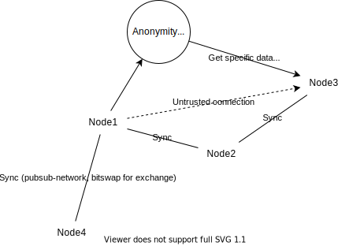

# Notes for Melotte

Melotte is a project that aims to create a framework for true dweb applications. Here we review the differences, especially the ideological ones.

- ZeroNet 

ZeroNet, which inspired me to start the project, greatly overlaps with Melotte in terms of ideology. It focuses on privacy, degree of decentralization, and security. For privacy and security, they prioritized Tor integration. Though not having DHT, it is actually quite decentralized since a site is fully replicated among all its peers. The most notable drawback is its imperfection and lack of modularity.

- IPFS

IPFS is vastly different from ZeroNet. As a project started by a corporation and their backers, they have their own purposes. They don't prioritize Tor integration, the privacy, and anonymity. They, apparently, don't believe in full decentralization like me, a person with unrealistic ideals. They cooperate with blockchains, who create partially decentralized websites. 

- Dat

Dat is an academic project, which seems to have been discontinued somehow. 

- SSB

Similar to ZeroNet, but they are more idealistic since ZeroNet was advertised with 'Bitcoin encryption' blah blah. Their goal, however, doesn't overlap with me. They don't want a very competitive internet that has many more features. They hoped to solve a small set of problems and that's it. The lack of DHT isn't making it scale.

Melotte is defined to be more ambitious, instead of creating dedicated apps directly based on IPFS or libp2p, instead of creating a semi-decentralized blockchain financed website. Its goals include to be censorship-resistant, especially in authoritarian countries, which was only pursued and reached by one project above, ZeroNet. 

- [Changes to be made on IPFS](./changes.md)
- [Theories and abstractions](./abstractions.md)

### Reading notes

- [IPFS, OrbitDB, etc.]()
- [Dat, beaker]()

## Thoughts

Before starting to write any code, it's better to make it clear what are my goals. Dwebs are created for different purposes, Tor for dark web, IPFS for off-chain storage, and SSB for a decentralized social network. None of them has the exact same goal as mine, or I shouldn't start this project then. It's apparent that I want to create a network that is censorship-resistant at least as good as ZeroNet. However, it's unrealistic to assume that a dweb can survive in an authoritarian nation when noticed and dealt with. Workarounds like Lokinet should work, but not that decentralized though. And too much emphasis on robustness trades performance off. Therefore Melotte should, tackle pattern-recognition/protocol-characteristic based censorship if present. For anything stricter than that, relay protocols could be used. 

Strict F2F network is probably the ultimate solution to censorship, but due to its nature it's hard to scale, alone. 

In this scenario, we assume that governments try to disguise as nodes in the network, and all suspected IPs are blocked. Therefore we try to minimize IPs exposed to the public. The anonymity network could be tor, I2P or Lokinet, where users here are not expected to be P2P nodes. For open networks, we use the anonymity protocols and closed networks are directly connected so the performance are quite balanced. Specifically, site syncing would remain as fast as it was, and DHT would be even slower with anonymity networks. The network would be most efficient and resistant if there's only one site therefore.

> Site is defined to be some blocks that are universally synced at same time among its set of peers.

For this issue, given that each peer has limited capacity, we either designed a site that suits all needs, or different peers could always find their desired sites. How a peer finds its place in a network when it joins in, namely the site it needs, is called introduction. The ideal introduction of new peers is done in F2F way, invitation. Secondly, people could set up public servers to introduce new users to public nodes. 

How all these things will perform should resemble ZeroNet. In the strict F2F mode, it is more similar to blockchain. To reduce DHT cost, the protocol should aggregate like-minded peers, via repeated *introduction*, or with routing like DHT of course. After getting enough trust, the peer will be given more IPs within the local F2F network. Introduction is equivalent to the bootstrapping of DHT, but it sets up all the things Melotte needs and is more sophisticated.

### As an open network

Instead of trying to bring free speech to authoritarian countries as a private network, it could do more as an open network. Besides inheriting the advantages from IPFS, it could accomplish democracy, through sufficient competition it offers. It largely though not completely prevents treating people, content, app or website as means. It eliminates paywalls and internet barriers (try setting one up here if you don't believe it) via democracy, competition and censorship-resistance, so that the internet is more connected.
