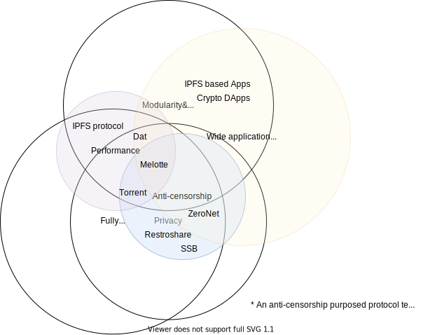

# Notes for Melotte

Melotte is a project that aims to create a framework for true dweb applications. Here we review the differences, especially the ideological ones.

- ZeroNet 

ZeroNet, which inspired me to start the project, greatly overlaps with Melotte in terms of ideology. It focuses on privacy, degree of decentralization, and security. For privacy and security, they prioritized Tor integration. Though not having DHT, it is actually quite decentralized since a site is fully replicated among all its peers. The most notable drawback is its imperfection and lack of modularity.

- IPFS

IPFS is vastly different from ZeroNet. As a project started by a corporation and their backers, they have their own purposes. They don't prioritize Tor integration, the privacy, and anonymity. They, apparently, don't believe in full decentralization like me, a person with unrealistic ideals. They cooperate with blockchains, who create partially decentralized websites. 

- Dat

Dat is an academic project, which seems to have been discontinued somehow. 

- SSB

Similar to ZeroNet, but they are more idealistic since ZeroNet was advertised with 'Bitcoin encryption' blah blah. Their goal, however, doesn't overlap with me. They don't want a very competitive internet that has many more features. They hoped to solve a small set of problems and that's it. The lack of DHT isn't making it scale.

Melotte is defined to be more ambitious, instead of creating dedicated apps directly based on IPFS or libp2p, instead of creating a semi-decentralized blockchain financed website. Its goals include to be censorship-resistant, especially in authoritarian countries, which was only pursued and reached by one project above, ZeroNet. 

- [Changes to be made on IPFS]()
- [General Architecture]()
- [Theories and abstractions]()
